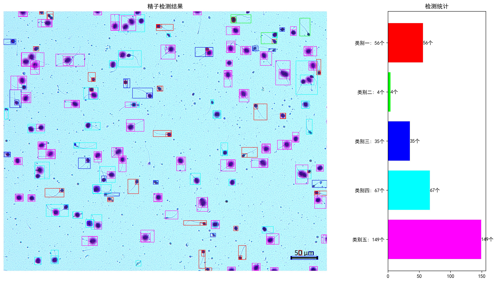
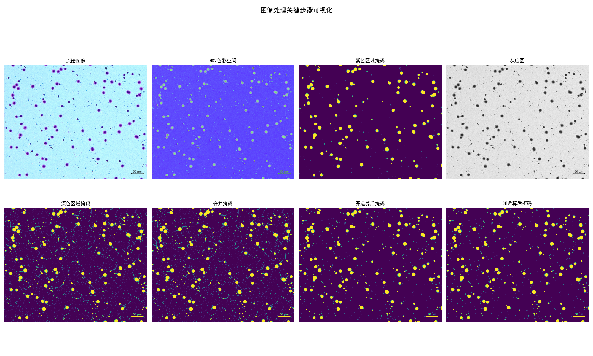
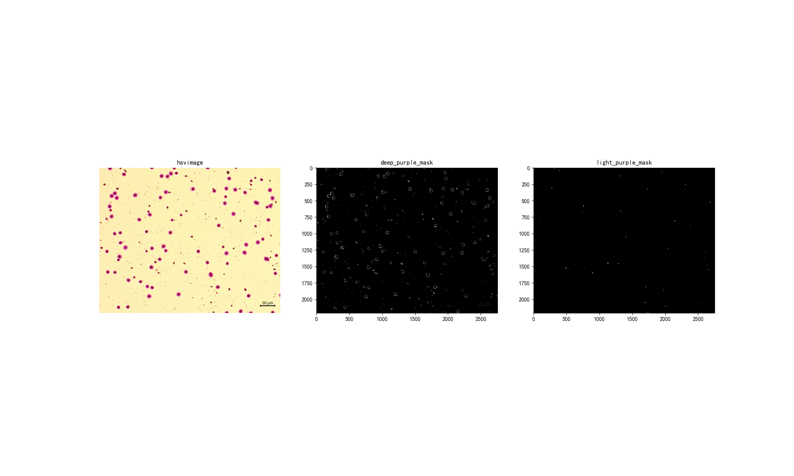
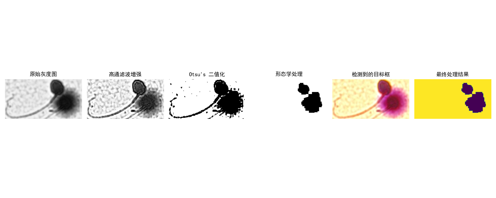

 
# 🔬 Intelligent Sperm Image Detection and Classification System  
click 【[中文版本](./README_CH.md)】
complete running: code.ipynb
## 📝 Project Overview  

This project is a biomedical image analysis system based on computer vision and image processing techniques, focusing on intelligent detection, classification, and visualization of sperm. Using advanced image processing algorithms, the project can accurately identify, locate, and classify targets from complex biomedical images.  
  
 

### 🌟 Key Features  

- 🖼️ Multi-step Image Processing Workflow  
- 🔍 Precise Target Detection Algorithms  
- 📊 Multi-dimensional Target Classification  
- 📈 Detailed Visualization of Results  
- 🧩 Modular Code Architecture  

## 🚀 Quick Start  
  
  
  

### Prerequisites  

- Python 3.8+  
- pip Package Manager  

### Installation Steps  

1. Clone the Project Repository  
~~~bash  
git clone https://github.com/yourusername/tadpole-detection.git  
cd tadpole-detection
~~~

2. Create Virtual Environment (Recommended)
~~~bash
python -m venv venv  
source venv/bin/activate  # Use `venv\Scripts\activate` on Windows  
~~~

3. Install Dependencies
~~~bash
pip install -r requirements.txt  
~~~

🔧 Project Structure
~~~bash
spermproject/  
│  
├── data/                # Test Images  
│   └── sperm.jpg  
│  
├── src/                 # Source Code  
│   ├── __init__.py  
│   ├── detection.py     # Core Detection Algorithms  
│   ├── utils.py         # Utility Functions  
│   └── visualization.py # Visualization Tools  
│  
├── tests/               # Unit Tests  
│   ├── conftest.py  
│   └── test_detection.py  
│  
├── visualization/       # Processing Step Visualizations  
│  
├── main.py              # Main Program Entry  
├── requirements.txt     # Dependency List  
└── README.md            # Project Documentation  
~~~

# 📖 User Guide
Basic Execution
python main.py  
Command Line Arguments (If Available)
python main.py --input data/custom_image.jpg  
🔬 Workflow Explanation
Image Preprocessing

Color Space Conversion (BGR → HSV)
Color Mask Generation
Morphological Processing
Target Detection

Contour Extraction
Bounding Box Generation
Abnormal Frame Processing
Color Classification

Light/Deep Purple Ratio Analysis
Multi-dimensional Classification
Result Visualization

Target Frame Annotation
Classification Statistical Charts
📊 Output Examples
Console Output
Detection Statistics:  
Category One: 5 targets  
Category Two: 3 targets  

Pixel Ratio for Detection Frames:  
Frame (x, y, w, h): Light/Deep Purple Ratio 0.3456  
Visualization Output
Processing step images generated in visualization/ directory
Generate result_detection.jpg final detection result
Generate result_detection.jpg image comparison
### 🧪 Unit Testing
pytest tests/  
pytest tests/test_detection.py  # Run specific tests  
pytest --cov=src  # Code coverage  
### 🤝 Contribution Guidelines
Fork the Project
Create Feature Branch (git checkout -b feature/AmazingFeature)
Commit Changes (git commit -m 'Added Some Amazing Feature')
Push to Branch (git push origin feature/AmazingFeature)
Submit Pull Request
### 🛠️ Technology Stack
Python 3.8+
OpenCV Image Processing
NumPy Numerical Computing
Matplotlib Data Visualization
Pytest Unit Testing
### 📌 Precautions
Ensure input images are clear with appropriate contrast
Recommended to use JPG or PNG formats
Large or extremely complex images may require algorithm parameter adjustments
### 🔒 License
This project is licensed under the MIT License - see the LICENSE file for details

### 🙌 Acknowledgments
OpenCV Development Team
NumPy Community
Matplotlib Project

Disclaimer: This project is for academic research and educational purposes only and should not be directly used for clinical diagnosis.

🌐 Contact
Project Homepage: [https://github.com/cyfedu-dlut/Medical-Sperm-Detection-and-Recognition-System]
Email: yfcao@mail.dlut.edu.cn
Personal Blog/Homepage: [https://cyfedu-dlut.github.io/PersonalWeb/]