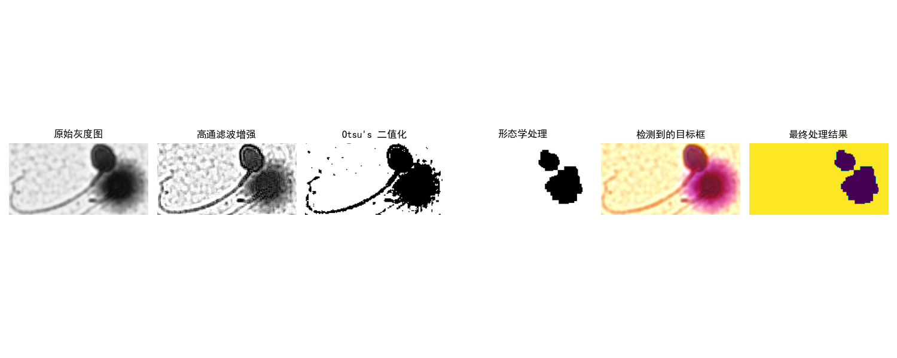

# 🔬 精子智能图像检测与分类系统 

完整代码运行：code.ipynb

## 📝 项目简介  

本项目是一个基于计算机视觉和图像处理技术的生物医学图像分析系统，专注于精子的智能检测、分类和可视化。通过先进的图像处理算法，项目能够从复杂的生物医学图像中准确识别、定位和分类目标。
  
  
### 🌟 主要特点  

- 🖼️ 多步骤图像处理流程  
- 🔍 精确的目标检测算法  
- 📊 多维度目标分类  
- 📈 详细的可视化结果展示  
- 🧩 模块化的代码架构  

## 🚀 快速开始  
  
  
  

### 前置条件  

- Python 3.8+  
- pip 包管理器  

### 安装步骤  

1. 克隆项目仓库  
```bash  
git clone https://github.com/yourusername/tadpole-detection.git  
cd tadpole-detection  
创建虚拟环境（推荐）
python -m venv venv  
source venv/bin/activate  # 在 Windows 上使用 `venv\Scripts\activate`  
安装依赖
pip install -r requirements.txt  
🔧 项目结构
tadpole-detection/  
│  
├── data/                # 测试图像  
│   └── sperm.jpg  
│  
├── src/                 # 源代码  
│   ├── __init__.py  
│   ├── detection.py     # 目标检测核心算法  
│   ├── utils.py         # 辅助工具函数  
│   └── visualization.py # 可视化工具  
│  
├── tests/               # 单元测试  
│   ├── conftest.py  
│   └── test_detection.py  
│  
├── visualization/       # 处理步骤可视化输出  
│  
├── main.py              # 主程序入口  
├── requirements.txt     # 依赖列表  
└── README.md            # 项目说明文档  
📖 使用指南
基本运行
python main.py  
命令行参数（如果有）
python main.py --input data/custom_image.jpg  
🔬 工作流程详解
图像预处理

色彩空间转换（BGR → HSV）
颜色掩码生成
形态学处理
目标检测

轮廓提取
边界框生成
异常框处理
颜色分类

浅紫色/深紫色比例分析
多维度分类
结果可视化

目标框标注
分类统计图表
📊 输出示例
控制台输出
检测统计结果:  
类别一: 5个目标  
类别二: 3个目标  

各检测框像素比例:  
框 (x, y, w, h): 浅紫色/深紫色比例 0.3456  
可视化输出
visualization/ 目录下生成处理步骤图像
生成 result_detection.jpg 最终检测结果
生成 result_detection.jpg 图像比较
🧪 单元测试
pytest tests/  
pytest tests/test_detection.py  # 运行特定测试  
pytest --cov=src  # 代码覆盖率  
🤝 贡献指南
Fork 项目
创建特性分支 (git checkout -b feature/AmazingFeature)
提交修改 (git commit -m '添加了某某特性')
推送到分支 (git push origin feature/AmazingFeature)
提交 Pull Request
🛠️ 技术栈
Python 3.8+
OpenCV 图像处理
NumPy 数值计算
Matplotlib 数据可视化
Pytest 单元测试
📌 注意事项
确保输入图像清晰、对比度适中
建议使用 JPG 或 PNG 格式
大型或极其复杂的图像可能需要调整算法参数
🔒 许可证
本项目基于 MIT 许可证 - 详见 LICENSE 文件

免责声明：本项目仅用于学术研究和教育目的，不应直接用于临床诊断。

🌐 联系方式
项目主页: [https://github.com/cyfedu-dlut/Medical-Sperm-Detection-and-Recognition-System]
邮箱: yfcao@mail.dlut.edu.cn
个人博客/主页: [https://cyfedu-dlut.github.io/PersonalWeb/]